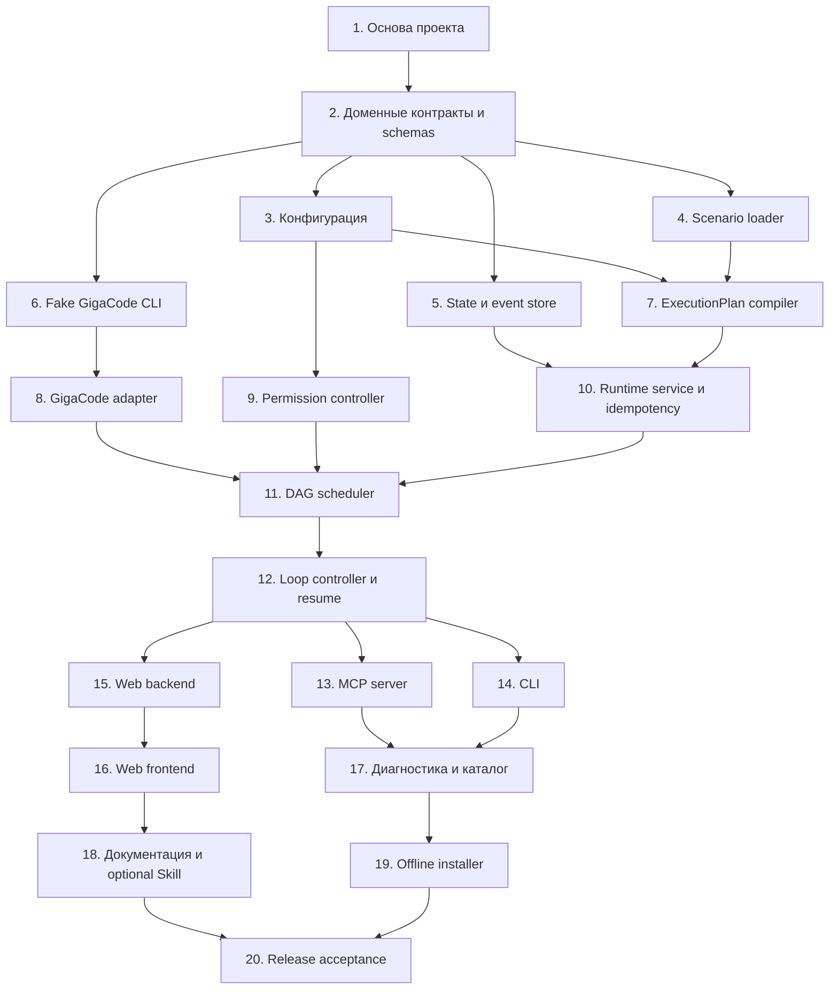

# GigaCode Agent Runtime v1 — план реализации

Дата: 2026-07-24

Основание:
`docs/superpowers/specs/2026-07-24-gigacode-agent-runtime-design.md`

Цель: реализовать локальный MCP-first runtime для декларативных многоагентных
сценариев GigaCode/Qwen CLI, включая DAG-параллельность, циклы, resume,
разрешения, Web UI и offline ZIP для macOS x86_64.

## 1. Правила выполнения плана

### 1.1 Рабочая ветка

Перед началом реализации:

```bash
git switch -c codex/runtime-v1
```

Документация дизайна остаётся в `main`; реализация ведётся отдельными небольшими
коммитами.

### 1.2 Цикл для каждой задачи

Для каждой функциональной задачи:

1. создать или уточнить тест;
2. запустить только этот тест и подтвердить ожидаемое падение;
3. добавить минимальную реализацию;
4. снова запустить целевой тест;
5. запустить затронутый test package;
6. выполнить `ruff check` и `mypy` для изменённых модулей;
7. сделать отдельный коммит с указанным сообщением.

Исключения допустимы только для статической документации, LICENSE и release
manifest.

### 1.3 Базовые команды

После создания окружения:

```bash
.venv/bin/python -m pytest
.venv/bin/python -m pytest tests/unit/test_config.py -q
.venv/bin/python -m ruff check src tests
.venv/bin/python -m mypy src
.venv/bin/python -m build
```

Тесты не должны обращаться к реальному LLM backend без отдельного маркера
`corporate_acceptance`.

### 1.4 Источники истины

- JSON Schema — внешний контракт YAML/JSON и persisted state.
- Python domain models — внутренний контракт runtime.
- ExecutionPlan snapshot — источник истины уже созданного run.
- `events.jsonl` — append-only история переходов.
- `run.json` — актуальная материализованная проекция состояния.
- fake GigaCode CLI — источник истины для автоматических subprocess-тестов.
- корпоративный GigaCode CLI — источник истины только для acceptance-тестов
  реального adapter и MCP registration.

## 2. Зависимости между этапами



После фиксации доменных контрактов задачи 3–6 можно выполнять параллельно.
После готовности engine задачи 13–15 также независимы. Объединение веток
выполняется только после прохождения общих schema и integration tests.

## 3. Задача 1 — основа Python-проекта

### Файлы

Создать:

- `pyproject.toml`;
- `README.md`;
- `LICENSE`;
- `CHANGELOG.md`;
- `src/gigacode_agent_runtime/__init__.py`;
- `src/gigacode_agent_runtime/__main__.py`;
- `src/gigacode_agent_runtime/version.py`;
- `tests/unit/test_package_metadata.py`;
- `tests/conftest.py`.

Изменить:

- `.gitignore`.

### Реализация

1. Указать `requires-python = ">=3.11,<3.15"`.
2. Создать console script:
   `agent-runtime = gigacode_agent_runtime.cli:main`.
3. Разделить зависимости:
   - runtime: `anyio`, `jsonschema`, `PyYAML`, официальный Python MCP SDK,
     Starlette, Uvicorn;
   - dev: `pytest`, `pytest-timeout`, `httpx`, `ruff`, `mypy`,
     `types-PyYAML`, `build`.
4. Использовать `src` layout и включить Web UI assets в wheel.
5. Задать Apache-2.0.
6. В `__main__.py` делегировать в CLI, не импортируя MCP/Web при простом
   `--version`.
7. Добавить единый `__version__`.

Точные версии зависимостей фиксируются в задаче offline packaging после
проверки wheels для Python 3.11–3.14. В `pyproject.toml` до этого используются
ограниченные совместимые диапазоны.

### Тесты

- package импортируется;
- `__version__` непустой и соответствует package metadata;
- `python -m gigacode_agent_runtime --version` завершается с кодом 0;
- импорт package не запускает Web UI, MCP или subprocess.

### Проверка

```bash
python3 -m venv .venv
.venv/bin/python -m pip install -e '.[dev]'
.venv/bin/python -m pytest tests/unit/test_package_metadata.py -q
.venv/bin/python -m ruff check src tests
```

### Коммит

```text
build: initialize Python runtime package
```

## 4. Задача 2 — доменная модель, ошибки и JSON Schema

### Файлы

Создать:

- `src/gigacode_agent_runtime/domain.py`;
- `src/gigacode_agent_runtime/errors.py`;
- `src/gigacode_agent_runtime/schema_registry.py`;
- `schemas/config-v1.schema.json`;
- `schemas/scenario-v1.schema.json`;
- `schemas/execution-plan-v1.schema.json`;
- `schemas/run-state-v1.schema.json`;
- `schemas/run-event-v1.schema.json`;
- `tests/unit/test_schema_registry.py`;
- `tests/unit/test_domain.py`;
- `tests/fixtures/scenarios/minimal-valid.yaml`;
- `tests/fixtures/scenarios/invalid-unknown-key.yaml`.

Изменить:

- `pyproject.toml` — включить top-level schemas в installed data;
- `src/gigacode_agent_runtime/version.py` — добавить версии контрактов.

### Реализация

1. Определить string enums:
   - `RunStatus`;
   - `StepStatus`;
   - `PermissionMode`;
   - `OnLimit`;
   - `FailureReason`.
2. Определить frozen dataclasses для:
   - source reference;
   - scenario metadata;
   - agent definition;
   - step definition;
   - loop definition;
   - retry policy;
   - ExecutionPlan;
   - run/step snapshots;
   - event envelope.
3. Ввести базовую typed error `AgentRuntimeError` с полями:
   `code`, `message`, `details`, `retryable`.
4. Реализовать registry через `importlib.resources` или установленный data
   directory без зависимости от текущего cwd.
5. Использовать JSON Schema Draft 2020-12.
6. В schemas запретить неизвестные поля через `unevaluatedProperties: false`.
7. Не включать секретные значения в схемы persisted state.

### Тесты

- все schemas сами валидны;
- минимальный scenario проходит;
- неизвестный ключ отклоняется со стабильным path;
- enum значения совпадают со спецификацией;
- schema resources доступны из собранного wheel, а не только checkout.

### Проверка

```bash
.venv/bin/python -m pytest tests/unit/test_schema_registry.py tests/unit/test_domain.py -q
.venv/bin/python -m build
python3 -m zipfile -l dist/*.whl
```

### Коммит

```text
feat: define versioned runtime contracts
```

## 5. Задача 3 — пути и загрузка глобальной конфигурации

Зависит от задачи 2. Может выполняться параллельно с задачами 4–6.

### Файлы

Создать:

- `src/gigacode_agent_runtime/paths.py`;
- `src/gigacode_agent_runtime/config.py`;
- `tests/unit/test_paths.py`;
- `tests/unit/test_config.py`;
- `tests/fixtures/config/minimal.yaml`;
- `tests/fixtures/config/full.yaml`.

### Реализация

1. Реализовать XDG-независимые v1 paths, заданные дизайном:
   `~/.gigacode/agent-runtime`.
2. Поддержать override data/config paths только через CLI/API-конструктор для
   тестов, не через неограниченную интерполяцию YAML.
3. Раскрывать `~`, затем canonicalize.
4. Валидировать config schema до построения domain object.
5. Применять defaults централизованно.
6. Проверять:
   - положительные concurrency/time limits;
   - model allowlist;
   - loop limits;
   - `full_access` gates;
   - Web host равен `127.0.0.1` в v1.
7. Реализовать allowlist переменных окружения без чтения/логирования их
   значений на этапе plan.
8. Возвращать immutable `EffectiveConfig`.

### Тесты

- missing config создаёт безопасные defaults в памяти;
- unknown field — `CONFIG_INVALID`;
- отрицательный limit отклоняется;
- `allow_full_access` по умолчанию false;
- Web bind на `0.0.0.0` отклоняется;
- env allowlist сохраняет имена, но serialization не содержит значений;
- пути тестов не зависят от реального HOME пользователя.

### Проверка

```bash
.venv/bin/python -m pytest tests/unit/test_paths.py tests/unit/test_config.py -q
```

### Коммит

```text
feat: load validated runtime configuration
```

## 6. Задача 4 — Scenario loader и безопасность ссылок

Зависит от задачи 2. Может выполняться параллельно с задачами 3, 5 и 6.

### Файлы

Создать:

- `src/gigacode_agent_runtime/scenario_loader.py`;
- `src/gigacode_agent_runtime/source_resolver.py`;
- `src/gigacode_agent_runtime/interpolation.py`;
- `tests/unit/test_scenario_loader.py`;
- `tests/unit/test_source_resolver.py`;
- `tests/unit/test_interpolation.py`;
- `tests/fixtures/scenarios/path-escape.yaml`;
- `tests/fixtures/scenarios/symlink-escape.yaml`;
- `tests/fixtures/scenarios/parallel-valid.yaml`.

### Реализация

1. Загружать YAML через `yaml.safe_load`, JSON через stdlib.
2. Ограничить размер scenario, prompt и schema files.
3. Искать сценарии в порядке:
   project → user → builtin.
4. Отклонять duplicate names внутри одного уровня.
5. Canonicalize все file references.
6. Проверять containment до открытия файла.
7. Запретить symlink escape, `..` escape и special device files.
8. Реализовать только разрешённые ссылки `${inputs...}`, `${steps...}`,
   `${loop...}`, `${run.id}`, `${workspace.root}`.
9. Не выполнять filter/function/eval и не делать повторную интерполяцию
   получившейся строки.
10. Загружать prompt/schema content в snapshot source bundle.

### Тесты

- project перекрывает user, user перекрывает builtin;
- duplicate в одном каталоге падает;
- YAML anchors не приводят к исполняемому объекту;
- traversal и symlink escape блокируются;
- неизвестный namespace интерполяции блокируется;
- строка `$()` остаётся обычными данными;
- результат первой подстановки не интерполируется повторно;
- абсолютный путь вне allowlist отклоняется.

### Проверка

```bash
.venv/bin/python -m pytest \
  tests/unit/test_scenario_loader.py \
  tests/unit/test_source_resolver.py \
  tests/unit/test_interpolation.py -q
```

### Коммит

```text
feat: load contained declarative scenarios
```

## 7. Задача 5 — atomic state store, event log и locks

Зависит от задачи 2. Может выполняться параллельно с задачами 3, 4 и 6.

### Файлы

Создать:

- `src/gigacode_agent_runtime/state_machine.py`;
- `src/gigacode_agent_runtime/state_store.py`;
- `src/gigacode_agent_runtime/event_log.py`;
- `src/gigacode_agent_runtime/locking.py`;
- `src/gigacode_agent_runtime/serialization.py`;
- `tests/unit/test_state_machine.py`;
- `tests/unit/test_state_store.py`;
- `tests/unit/test_event_log.py`;
- `tests/integration/test_state_crash_recovery.py`.

### Реализация

1. Реализовать canonical JSON:
   UTF-8, sorted keys, stable separators, UTC timestamps.
2. Генерировать sortable run ID без новой runtime-зависимости.
3. Создавать run directory атомарно.
4. Записывать `run.json` через temp file в том же каталоге:
   flush → fsync file → `os.replace` → fsync directory.
5. Записывать `events.jsonl` append-only с монотонным `event_id`.
6. Использовать `fcntl.flock` для одного writer на macOS.
7. Централизовать допустимые переходы run state.
8. При открытии run со статусом `running`, не принадлежащего живому writer,
   переводить его в `interrupted` отдельным recovery event.
9. Не удалять повреждённый state; сохранять forensic copy и возвращать
   `STATE_CORRUPTED`.

### Тесты

- все допустимые переходы проходят;
- недопустимые переходы не изменяют файл;
- process crash между temp write и replace не повреждает старый state;
- два writer не получают lock одновременно;
- event IDs не повторяются;
- cursor pagination стабильна;
- running после имитации crash становится interrupted;
- corrupted JSON не перезаписывается автоматически.

### Проверка

```bash
.venv/bin/python -m pytest \
  tests/unit/test_state_machine.py \
  tests/unit/test_state_store.py \
  tests/unit/test_event_log.py \
  tests/integration/test_state_crash_recovery.py -q
```

### Коммит

```text
feat: persist atomic run state and events
```

## 8. Задача 6 — fake GigaCode CLI

Зависит от задачи 2. Может выполняться параллельно с задачами 3–5.

### Файлы

Создать:

- `tests/fixtures/fake_gigacode/gigacode`;
- `tests/fixtures/fake_gigacode/fake_gigacode.py`;
- `tests/fixtures/fake_gigacode/profiles/*.json`;
- `tests/helpers/fake_gigacode.py`;
- `tests/integration/test_fake_gigacode.py`.

### Реализация

Fake CLI должен:

1. отвечать на `--version`, `--help` и `mcp --help`;
2. принимать model, approval/input/output formats;
3. читать text/stream-json из stdin;
4. выдавать детерминированный JSON/stream-json;
5. поддерживать профили:
   - success;
   - delayed success;
   - invalid JSON;
   - transient failure;
   - permanent failure;
   - stderr burst;
   - no output;
   - timeout;
   - ignore SIGTERM;
   - missing capability;
6. записывать в отдельный trace file PID, PGID, monotonic start/end и
   sanitized arguments;
7. никогда не использовать сеть.

Поведение выбирается через специальную тестовую переменную окружения, которая
не существует в production adapter.

### Тесты

- fake executable работает из пути с пробелами;
- stream события корректно разделены;
- delayed процессы дают измеримые перекрывающиеся интервалы;
- SIGTERM/forced termination можно проверить;
- trace не содержит prompt body или секретное значение.

### Проверка

```bash
.venv/bin/python -m pytest tests/integration/test_fake_gigacode.py -q
```

### Коммит

```text
test: add deterministic fake GigaCode CLI
```

## 9. Задача 7 — компилятор ExecutionPlan

Зависит от задач 3 и 4.

### Файлы

Создать:

- `src/gigacode_agent_runtime/plan_compiler.py`;
- `src/gigacode_agent_runtime/dag.py`;
- `src/gigacode_agent_runtime/hashing.py`;
- `tests/unit/test_dag.py`;
- `tests/unit/test_plan_compiler.py`;
- `tests/unit/test_plan_hash.py`;
- `tests/fixtures/plans/*.json`.

### Реализация

1. Проверить ссылки agent/step/input/output до выполнения.
2. Найти циклы в `needs` и вернуть путь цикла.
3. Построить детерминированные topological waves.
4. Проверить, что loop body не содержит вложенный loop.
5. Применить global/scenario defaults к timeout, retry, parallelism и
   permissions.
6. Встроить в план содержимое prompt/output schema, а не только paths.
7. Нормализовать `when` и `until`.
8. Добавить capability requirements, но не считать их доступными до adapter
   detection.
9. Вычислить:
   - scenario content hash;
   - inputs hash;
   - effective config hash;
   - ExecutionPlan hash.
10. Сделать `ExecutionPlan` frozen и сериализуемым в schema v1.

### Тесты

- sequential → две волны;
- parallel → одна волна;
- fan-out/fan-in → правильные волны;
- cycle → `SCENARIO_INVALID` с узлами;
- порядок YAML mapping не меняет hash;
- изменение prompt/schema/permission меняет hash;
- изменение нерелевантного форматирования YAML не меняет hash;
- full-access loop получает effective max 3;
- nested loop отклоняется.

### Проверка

```bash
.venv/bin/python -m pytest \
  tests/unit/test_dag.py \
  tests/unit/test_plan_compiler.py \
  tests/unit/test_plan_hash.py -q
```

### Коммит

```text
feat: compile deterministic execution plans
```

## 10. Задача 8 — GigaCode/Qwen CLI adapter

Зависит от задачи 6.

### Файлы

Создать:

- `src/gigacode_agent_runtime/adapters/__init__.py`;
- `src/gigacode_agent_runtime/adapters/gigacode_qwen.py`;
- `src/gigacode_agent_runtime/adapters/capabilities.py`;
- `src/gigacode_agent_runtime/adapters/stream_parser.py`;
- `src/gigacode_agent_runtime/process_supervisor.py`;
- `src/gigacode_agent_runtime/redaction.py`;
- `tests/unit/test_capabilities.py`;
- `tests/unit/test_stream_parser.py`;
- `tests/unit/test_redaction.py`;
- `tests/integration/test_gigacode_adapter.py`;
- `tests/fixtures/gigacode_help/*.txt`;
- `tests/fixtures/gigacode_stream/*.jsonl`.

### Реализация

1. Искать executable:
   explicit config → `PATH` → `~/.gigacode/bin/gigacode`.
2. Собирать capability profile из реальных help outputs, а не только version.
3. Сохранить sanitized capability snapshot в plan/run.
4. Строить argv list без `shell=True`.
5. Предпочитать stream-json stdin/stdout.
6. Иметь проверяемый fallback на позиционный prompt/JSON.
7. Не логировать prompt и system prompt в командной строке.
8. Поддержать явные adapter options для sandbox, working directory,
   approval mode и allowed tools; не подменять отсутствие sandbox одним `cwd`.
9. Ограничивать размеры stdout/stderr без блокировки pipe.
10. Создавать отдельную process group.
11. Реализовать graceful terminate и forced kill всей группы.
12. Нормализовать process exit, invalid output, timeout и transient error в
    typed result.
13. Fail closed при отсутствии требуемой capability.

### Тесты

- executable path с пробелами;
- missing executable → `CAPABILITY_UNAVAILABLE`;
- help parser распознаёт каждую разрешённую capability;
- неизвестный help не даёт ложный full access;
- stream parser переживает chunk boundaries;
- invalid JSON не становится output;
- stderr сохраняется отдельно;
- timeout завершает process group;
- sandbox/working-directory options формируются только из validated policy;
- env содержит только allowlisted names;
- redaction удаляет secret values;
- prompt отсутствует в metadata/trace.

### Корпоративный fixture gate

На корпоративном Mac позже выполнить безопасный сценарий без секретных данных и
сохранить:

- `gigacode --version`;
- `gigacode --help`;
- `gigacode mcp add --help`;
- один sanitized `--input-format stream-json --output-format stream-json`
  transcript.

Перед добавлением fixture вручную проверить отсутствие токенов, cookies,
внутренних URL и пользовательских данных.

### Проверка

```bash
.venv/bin/python -m pytest \
  tests/unit/test_capabilities.py \
  tests/unit/test_stream_parser.py \
  tests/unit/test_redaction.py \
  tests/integration/test_gigacode_adapter.py -q
```

### Коммит

```text
feat: run agents through GigaCode Qwen CLI
```

## 11. Задача 9 — Permission Controller

Зависит от задачи 3.

### Файлы

Создать:

- `src/gigacode_agent_runtime/permissions.py`;
- `src/gigacode_agent_runtime/approval_store.py`;
- `tests/unit/test_permissions.py`;
- `tests/unit/test_approval_store.py`.

### Реализация

1. Разрешить режимы:
   `read_only`, `propose_only`, `workspace_write`, `full_access`.
2. Отделить runtime permission policy от CLI capability mapping.
3. Для full access проверять:
   - global enable;
   - explicit agent mode;
   - plan hash confirmation или trusted exact hash;
   - parallel full-access limiter;
   - full-access loop limit.
4. Approval record должен содержать run ID, exact plan hash, timestamp и
   approved gate; секреты и prompt не сохранять.
5. Изменение plan hash аннулирует approval.
6. Resume не расширяет исходный permission contract.
7. Если CLI не поддерживает требуемую семантику, вернуть
   `CAPABILITY_UNAVAILABLE` до запуска subprocess.
8. Full access не должен изменять env allowlist автоматически.
9. Для `workspace_write` требовать подтверждённый GigaCode sandbox, запускать
   процесс с cwd workspace и запрещать старт, если containment не может быть
   обеспечен.
10. Для `read_only` и `propose_only` использовать plan/restricted tool profile;
    для `full_access` снимать sandbox runtime только после двойного gate.

### Тесты

- agent full access + global false → denied;
- global true + нет agent declaration → нет расширения;
- confirmation точного hash разрешает запуск;
- старый hash не работает;
- trusted hash работает только при полном совпадении;
- по умолчанию одновременно доступен один full-access slot;
- resume сохраняет исходный mode;
- unsupported CLI profile fail closed.
- workspace_write без sandbox fail closed;
- workspace_write command profile содержит sandbox и точный workspace cwd;
- read_only не получает write-capable runtime profile.

### Проверка

```bash
.venv/bin/python -m pytest \
  tests/unit/test_permissions.py \
  tests/unit/test_approval_store.py -q
```

### Коммит

```text
feat: enforce explicit agent permissions
```

## 12. Задача 10 — Runtime Service, snapshots и idempotency

Зависит от задач 5 и 7.

### Файлы

Создать:

- `src/gigacode_agent_runtime/runtime_service.py`;
- `src/gigacode_agent_runtime/run_manager.py`;
- `src/gigacode_agent_runtime/run_factory.py`;
- `src/gigacode_agent_runtime/idempotency.py`;
- `src/gigacode_agent_runtime/artifacts.py`;
- `tests/unit/test_idempotency.py`;
- `tests/integration/test_run_creation.py`;
- `tests/integration/test_run_snapshots.py`.

### Реализация

1. Реализовать use cases:
   validate, plan, create run, read status/events/result/artifacts.
2. На `start_run` сначала полностью компилировать plan.
3. Создавать snapshot:
   scenario, effective config, plan, prompt/schema bundle, inputs,
   capability requirements.
4. Не сохранять secret env values.
5. Индексировать `idempotency_key` атомарно.
6. Один key + одинаковые hashes возвращает существующий run.
7. Один key + другие hashes возвращает `IDEMPOTENCY_CONFLICT`.
8. Обеспечить безопасные artifact names и MIME/size metadata.
9. Не отдавать произвольный file path через API.
10. Создать process-local `RunManager`, который владеет долгоживущей AnyIO task
    group, принимает run после `start_run` и при shutdown переводит
    незавершённые runs в `interrupted`.

### Тесты

- complete snapshot существует до первого subprocess;
- изменение внешнего scenario после start не меняет snapshot;
- повторный idempotent start возвращает тот же run ID;
- конфликт не создаёт каталог;
- artifact traversal блокируется;
- run result до завершения возвращает typed nonterminal response.
- run manager продолжает задачу после возврата `start_run`;
- shutdown manager сохраняет interruption event и не оставляет orphan process.

### Проверка

```bash
.venv/bin/python -m pytest \
  tests/unit/test_idempotency.py \
  tests/integration/test_run_creation.py \
  tests/integration/test_run_snapshots.py -q
```

### Коммит

```text
feat: create immutable resumable runs
```

## 13. Задача 11 — DAG Scheduler и агентские шаги

Зависит от задач 8–10.

### Файлы

Создать:

- `src/gigacode_agent_runtime/scheduler.py`;
- `src/gigacode_agent_runtime/step_runner.py`;
- `src/gigacode_agent_runtime/retry.py`;
- `src/gigacode_agent_runtime/cancellation.py`;
- `tests/unit/test_retry.py`;
- `tests/integration/test_scheduler_sequential.py`;
- `tests/integration/test_scheduler_parallel.py`;
- `tests/integration/test_scheduler_mixed.py`;
- `tests/integration/test_scheduler_failure.py`;
- `tests/integration/test_scheduler_cancel.py`.

### Реализация

1. Использовать AnyIO task groups и capacity limiters.
2. Запускать только ready nodes.
3. Детерминированно выбирать ready nodes по ExecutionPlan order.
4. Проверять `when` перед выделением process slot.
5. Валидировать agent output до `step.completed`.
6. Отделить retry attempt от business iteration.
7. Применять backoff, не блокируя остальные ready nodes.
8. Писать lifecycle events и heartbeat.
9. Реализовать cooperative pause:
   - не начинать новые шаги;
   - дать активным шагам завершиться;
   - затем установить `paused`.
10. Реализовать cancel активных process groups.
11. Зафиксировать v1 failure policy:
    - после окончательной ошибки шага новые шаги не запускаются;
    - активные sibling steps мягко отменяются;
    - зависимые steps получают `blocked`;
    - run становится `failed`;
    - уже готовые artifacts сохраняются.

### Тесты

- sequential интервалы не перекрываются;
- parallel интервалы fake CLI реально перекрываются;
- concurrency никогда не превышает limit;
- mixed fan-in стартует после обоих upstream;
- retry не увеличивает loop iteration;
- invalid output retryable по policy;
- pause не убивает активный шаг;
- cancel завершает группу и run;
- failure блокирует downstream и не теряет completed artifacts;
- full-access limiter соблюдается независимо от общего limiter.

### Проверка

```bash
.venv/bin/python -m pytest \
  tests/unit/test_retry.py \
  tests/integration/test_scheduler_sequential.py \
  tests/integration/test_scheduler_parallel.py \
  tests/integration/test_scheduler_mixed.py \
  tests/integration/test_scheduler_failure.py \
  tests/integration/test_scheduler_cancel.py -q
```

### Коммит

```text
feat: schedule sequential and parallel agent steps
```

## 14. Задача 12 — условия, loop controller, input gates и resume

Зависит от задачи 11.

### Файлы

Создать:

- `src/gigacode_agent_runtime/conditions.py`;
- `src/gigacode_agent_runtime/loop_controller.py`;
- `src/gigacode_agent_runtime/input_gates.py`;
- `src/gigacode_agent_runtime/resume.py`;
- `tests/unit/test_conditions.py`;
- `tests/unit/test_loop_controller.py`;
- `tests/integration/test_loop_review_repair.py`;
- `tests/integration/test_loop_limits.py`;
- `tests/integration/test_input_gate.py`;
- `tests/integration/test_resume.py`.

### Реализация

1. Реализовать typed operators:
   `eq`, `ne`, `lt`, `lte`, `gt`, `gte`, `contains`, `exists`,
   `all`, `any`, `not`.
2. Не выполнять произвольные выражения.
3. Исполнять loop body как внутренний DAG.
4. Запускать следующую итерацию только после терминального состояния текущей.
5. Сохранять iteration state после каждого шага.
6. Вычислять no-progress fingerprint канонически.
7. Реализовать `fail`, `pause`, `best_effort`.
8. Реализовать `waiting_for_input` и typed `provide_input`.
9. Resume должен:
   - открыть original plan snapshot;
   - не повторять completed steps;
   - повторить только interrupted/retryable instance;
   - продолжить текущую loop iteration;
   - сохранить approvals и permission limits без расширения.
10. При shutdown runtime корректно помечать незавершённый run interrupted.

### Тесты

- каждый condition operator и type mismatch;
- approved на первой итерации пропускает repair;
- review/repair достигает approved на N-й итерации;
- max iterations: fail/pause/best effort;
- no-progress срабатывает на точном пороге;
- independent loop nodes могут идти параллельно;
- nested loop отклонён ещё компилятором;
- provide input только для активного gate;
- restart/resume не повторяет completed step;
- plan file, изменённый снаружи, не заменяет snapshot;
- full-access approval не переносится на другой hash.

### Проверка

```bash
.venv/bin/python -m pytest \
  tests/unit/test_conditions.py \
  tests/unit/test_loop_controller.py \
  tests/integration/test_loop_review_repair.py \
  tests/integration/test_loop_limits.py \
  tests/integration/test_input_gate.py \
  tests/integration/test_resume.py -q
```

### Коммит

```text
feat: control loops and resume interrupted runs
```

## 15. Задача 13 — MCP stdio server

Зависит от задачи 12.

### Файлы

Создать:

- `src/gigacode_agent_runtime/mcp_server.py`;
- `src/gigacode_agent_runtime/mcp_tools.py`;
- `src/gigacode_agent_runtime/mcp_errors.py`;
- `tests/mcp/test_tool_discovery.py`;
- `tests/mcp/test_scenario_tools.py`;
- `tests/mcp/test_run_lifecycle.py`;
- `tests/mcp/test_stdio_cleanliness.py`;
- `tests/mcp/test_mcp_errors.py`.

### Реализация

1. Использовать официальный Python MCP SDK с зафиксированной версией.
2. Зарегистрировать инструменты:
   - `list_scenarios`;
   - `describe_scenario`;
   - `validate_scenario`;
   - `plan_scenario`;
   - `diagnose_runtime`;
   - `start_run`;
   - `get_run_status`;
   - `get_run_events`;
   - `get_run_result`;
   - `get_run_artifacts`;
   - `provide_input`;
   - `approve_run`;
   - `pause_run`;
   - `resume_run`;
   - `cancel_run`;
   - `open_dashboard`.
3. `start_run` должен возвращаться после создания/scheduling run, не ждать
   финального результата.
4. Все ошибки переводить в стабильные MCP result contracts.
5. Все runtime logs отправлять в stderr/file logger.
6. Добавить bounded pagination для events/artifacts.
7. Не отдавать secret values, raw environment и произвольные filesystem paths.

### Тесты

- discovery возвращает полный набор tools;
- input/output schemas стабильны;
- inline scenario проходит validate/plan/start;
- polling доводит fake run до completed;
- idempotency работает через MCP;
- approval/input/resume/cancel проходят end-to-end;
- stdout содержит только JSON-RPC frames;
- traceback не попадает в protocol output;
- большие events требуют cursor.

### Проверка

```bash
.venv/bin/python -m pytest tests/mcp -q
```

### Коммит

```text
feat: expose runtime through local MCP stdio
```

## 16. Задача 14 — CLI

Зависит от задачи 12. Может выполняться параллельно с задачами 13 и 15.

### Файлы

Создать:

- `src/gigacode_agent_runtime/cli.py`;
- `src/gigacode_agent_runtime/cli_format.py`;
- `tests/cli/test_cli_scenarios.py`;
- `tests/cli/test_cli_runs.py`;
- `tests/cli/test_cli_exit_codes.py`.

### Реализация

1. Реализовать команды из дизайна.
2. Все команды должны иметь `--json`.
3. Human output направлять в stdout только для CLI, не переиспользовать его в
   MCP server.
4. stderr использовать для diagnostics/errors.
5. Стабилизировать exit codes:
   - 0 success;
   - 2 invalid input/config;
   - 3 permission/approval;
   - 4 runtime/process failure;
   - 5 interrupted/cancelled;
   - 10 internal error.
6. `events --follow` использовать cursor без busy loop.
7. `dashboard --open` открывает браузер только по явному флагу.
8. `agent-runtime run` работает в foreground до терминального состояния;
   detached/background режим в v1 отсутствует.

### Тесты

- каждая команда имеет help;
- JSON output parseable;
- invalid scenario даёт exit 2;
- run/status/result работает с fake CLI;
- cancel/resume корректно отражаются;
- `mcp-serve` не наследует CLI banners.

### Проверка

```bash
.venv/bin/python -m pytest tests/cli -q
```

### Коммит

```text
feat: add runtime command line interface
```

## 17. Задача 15 — Web backend, auth и SSE

Зависит от задачи 12. Может выполняться параллельно с задачами 13 и 14.

### Файлы

Создать:

- `src/gigacode_agent_runtime/web/__init__.py`;
- `src/gigacode_agent_runtime/web/server.py`;
- `src/gigacode_agent_runtime/web/auth.py`;
- `src/gigacode_agent_runtime/web/api.py`;
- `src/gigacode_agent_runtime/web/sse.py`;
- `src/gigacode_agent_runtime/web/activity.py`;
- `tests/web/test_web_bind.py`;
- `tests/web/test_web_auth.py`;
- `tests/web/test_web_api.py`;
- `tests/web/test_web_sse.py`;
- `tests/web/test_activity_status.py`.

### Реализация

1. Bind только `127.0.0.1`; другой host отклонять.
2. Выбирать свободный порт без TOCTOU-повторного bind.
3. Создавать криптографически случайный one-time bootstrap token.
4. Принимать token из fragment через JS POST и выдавать:
   `HttpOnly`, `SameSite=Strict`, short-lived session cookie.
5. Защитить mutation endpoints CSRF token.
6. Добавить CSP, `X-Content-Type-Options`, `Referrer-Policy`.
7. SSE поддерживает `Last-Event-ID`/cursor и heartbeat.
8. Реализовать API для list/status/events/result/artifacts и controls.
9. Классифицировать RUNNING/SILENT/POSSIBLY_STALLED/TIMED_OUT/PROCESS_EXITED
   по process metadata и thresholds.
10. Не считать отсутствие output единственным доказательством зависания.

### Тесты

- сервер не слушает внешний interface;
- неверный/повторный bootstrap token отклонён;
- cookie attributes корректны;
- mutation без CSRF отклоняется;
- SSE reconnect не дублирует события;
- activity classification покрывает границы времени;
- artifact path traversal невозможен;
- API не возвращает secrets.

### Проверка

```bash
.venv/bin/python -m pytest tests/web/test_web_bind.py \
  tests/web/test_web_auth.py \
  tests/web/test_web_api.py \
  tests/web/test_web_sse.py \
  tests/web/test_activity_status.py -q
```

### Коммит

```text
feat: serve authenticated local runtime dashboard
```

## 18. Задача 16 — статический Web UI

Зависит от задачи 15.

### Файлы

Создать:

- `src/gigacode_agent_runtime/web/static/index.html`;
- `src/gigacode_agent_runtime/web/static/app.js`;
- `src/gigacode_agent_runtime/web/static/styles.css`;
- `src/gigacode_agent_runtime/web/static/icons.svg`;
- `tests/web/test_static_assets.py`;
- `tests/web/test_dashboard_flow.py`.

### Реализация

1. Не использовать Node, React, CDN, web fonts и внешние assets.
2. Показать:
   - список run;
   - DAG/waves;
   - step/model/permission/status;
   - active duration/last event/PID;
   - loops/retries/timeouts;
   - output, reviewer feedback, stderr и artifacts;
   - blockers.
3. Реализовать controls:
   pause, resume, cancel, provide input, approve exact full-access plan.
4. Подключить SSE с backoff/reconnect.
5. Различать no events, disconnected и runtime stopped.
6. Ограничивать визуальный размер logs и загружать продолжение по запросу.
7. Использовать доступные семантические HTML controls и keyboard focus.

### Тесты

- wheel содержит все static assets;
- HTML не содержит внешних URL;
- CSP не требует inline script;
- bootstrap fragment удаляется из address bar после обмена;
- fake run проходит UI lifecycle через ASGI browserless test;
- controls вызывают ожидаемые API;
- недоступный runtime показывает явный disconnected status.

Отдельный ручной smoke выполняется в реальном браузере на macOS перед release.

### Проверка

```bash
.venv/bin/python -m pytest \
  tests/web/test_static_assets.py \
  tests/web/test_dashboard_flow.py -q
.venv/bin/python -m build
```

### Коммит

```text
feat: add dependency-free agent monitoring UI
```

## 19. Задача 17 — диагностика и встроенный каталог

Зависит от задач 13 и 14.

### Файлы

Создать:

- `src/gigacode_agent_runtime/diagnostics.py`;
- `src/gigacode_agent_runtime/catalog.py`;
- `examples/scenarios/sequential.yaml`;
- `examples/scenarios/parallel.yaml`;
- `examples/scenarios/mixed.yaml`;
- `examples/scenarios/review-repair-loop.yaml`;
- `examples/prompts/*.md`;
- `examples/schemas/*.json`;
- `tests/unit/test_diagnostics.py`;
- `tests/integration/test_builtin_catalog.py`.

### Реализация

1. Реализовать checks:
   OS/arch, Python, runtime/schema versions, executable, CLI capabilities,
   directories, Web bind, model allowlist, dangerous permission settings.
2. Каждая проверка возвращает `ok|warning|error`, code и remediation.
3. Диагностика не делает реальный LLM-вызов по умолчанию.
4. Добавить отдельный opt-in subprocess smoke без пользовательских данных.
5. Упаковать examples как read-only builtin catalog.
6. Сценарии должны валидироваться без изменений.
7. Для фактического запуска model ID задаётся пользователем/config; examples не
   должны притворяться, что условный model ID существует.
8. `list_scenarios` показывает source: builtin/user/project.

### Тесты

- диагностические статусы стабильны;
- отсутствие GigaCode — error, а не traceback;
- unsupported architecture — error установщика и diagnostic warning/error;
- опасный full access config виден;
- все builtin scenarios проходят validate/plan;
- project override не изменяет builtin files.

### Проверка

```bash
.venv/bin/python -m pytest \
  tests/unit/test_diagnostics.py \
  tests/integration/test_builtin_catalog.py -q
.venv/bin/agent-runtime diagnose --json
```

### Коммит

```text
feat: diagnose runtime and ship scenario catalog
```

## 20. Задача 18 — пользовательская документация и optional Skill

Зависит от задач 13–17.

### Файлы

Создать:

- `docs/scenario-format.md`;
- `docs/permissions.md`;
- `docs/loops.md`;
- `docs/web-ui.md`;
- `docs/offline-installation.md`;
- `docs/troubleshooting.md`;
- `docs/mcp-api.md`;
- `optional-skill/SKILL.md`;
- `tests/docs/test_examples.py`;
- `tests/docs/test_skill_contract.py`.

Изменить:

- `README.md`;
- `CHANGELOG.md`.

### Реализация

1. README объясняет:
   - локальную архитектуру;
   - отсутствие daemon;
   - где работают модели;
   - что происходит при закрытии GigaCode;
   - macOS-only статус v1.
2. Дать copy/paste examples для sequential/parallel/mixed/loop.
3. Описать `needs`, fan-out/fan-in и limits.
4. Отдельно предупредить, что full access не даёт root и не обходит macOS.
5. Описать recovery, state directories и безопасное удаление.
6. Optional Skill должен:
   - выбирать MCP tools;
   - сначала validate, затем plan, затем start;
   - не дублировать scheduler;
   - не быть обязательным для CLI/MCP;
   - не содержать Draw.io-специфичной логики.
7. Добавить troubleshooting для disconnected MCP, missing wheels, invalid model,
   waiting approval, silent/stalled и corrupted state.

### Тесты

- все YAML snippets валидируются;
- все tool names Skill существуют в MCP discovery;
- README не обещает Linux/full daemon;
- документация не содержит персональных абсолютных путей;
- примеры не содержат секретов.

### Проверка

```bash
.venv/bin/python -m pytest tests/docs -q
rg -n '/Users/|token|secret=' README.md docs optional-skill examples
```

### Коммит

```text
docs: document agent scenarios and MCP usage
```

## 21. Задача 19 — offline wheelhouse, installer и rollback

Зависит от задачи 17. Документация задачи 18 может выполняться параллельно.

### Файлы

Создать:

- `requirements/runtime-py311.lock`;
- `requirements/runtime-py312.lock`;
- `requirements/runtime-py313.lock`;
- `requirements/runtime-py314.lock`;
- `installer/install-macos.sh`;
- `installer/uninstall-macos.sh`;
- `installer/verify-installation.sh`;
- `installer/rollback.sh`;
- `installer/lib/common.sh`;
- `scripts/build-offline-release.sh`;
- `scripts/verify-offline-release.sh`;
- `release-manifest.json`;
- `tests/installer/test_release_manifest.py`;
- `tests/installer/test_installer_contract.py`;
- `tests/installer/test_rollback_contract.py`.

### Реализация

1. Зафиксировать hashes всех runtime dependencies отдельно для Python minor.
2. Скачать/build wheels на release-машине с сетью, но проверить offline install
   с заблокированной сетью.
3. Структура ZIP должна включать:
   - project wheel;
   - versioned wheelhouse 3.11–3.14;
   - pure Python shared wheels;
   - installer scripts;
   - examples/docs/optional Skill;
   - manifest с SHA-256 каждого файла.
4. Установщик:
   - проверяет Darwin/x86_64;
   - выбирает Python 3.11–3.14;
   - создаёт versioned install dir и venv;
   - вызывает pip только с `--no-index`;
   - не перезаписывает user config/scenarios;
   - регистрирует exact absolute launcher через `gigacode mcp add`;
   - проверяет `gigacode mcp list`;
   - откатывает изменения при ошибке.
5. Не использовать `--trust` по умолчанию.
6. Launcher должен сохранять MCP stdout чистым.
7. Rollback восстанавливает предыдущую version/registration.
8. Uninstall сохраняет data; `--purge-data` требует явного подтверждения.
9. Скрипты не используют небезопасные `eval`, непроверенные globs или широкое
   рекурсивное удаление.

### Тесты

- manifest покрывает каждый release file;
- отсутствуют sdist и неподдерживаемые architecture wheels;
- установочные команды содержат `--no-index`;
- failure injection после каждого installer stage вызывает rollback;
- uninstall без purge сохраняет data fixture;
- purge не может получить HOME/root как target;
- путь с пробелами работает;
- повторный install идемпотентен.

### Проверка

```bash
.venv/bin/python -m pytest tests/installer -q
scripts/build-offline-release.sh
scripts/verify-offline-release.sh dist/gigacode-agent-runtime-*-macos-x86_64.zip
```

### Коммит

```text
build: package offline macOS runtime installer
```

## 22. Задача 20 — полная проверка и release candidate

Зависит от всех предыдущих задач.

### Файлы

Создать:

- `tests/acceptance/test_end_to_end_fake.py`;
- `tests/acceptance/test_clean_offline_install.py`;
- `docs/release-checklist.md`;
- `docs/corporate-acceptance-checklist.md`;
- `artifacts/.gitkeep`.

Изменить:

- `CHANGELOG.md`;
- `release-manifest.json`.

### Локальный автоматический gate

```bash
.venv/bin/python -m ruff check src tests
.venv/bin/python -m mypy src
.venv/bin/python -m pytest -m 'not corporate_acceptance'
.venv/bin/python -m build
scripts/build-offline-release.sh
scripts/verify-offline-release.sh dist/gigacode-agent-runtime-*-macos-x86_64.zip
shasum -a 256 dist/gigacode-agent-runtime-*-macos-x86_64.zip
```

Обязательные доказательства:

- sequential intervals не перекрываются;
- parallel intervals перекрываются;
- mixed fan-in ждёт оба upstream;
- loop/retry имеют разные counters;
- resume не повторяет completed steps;
- full access требует двойного gate;
- MCP stdout чистый;
- Web SSE/status/control проходят;
- offline install не обращается в сеть;
- rollback и uninstall работают.

### Корпоративный macOS acceptance gate

Выполняется пользователем на корпоративном Mac из распакованного ZIP:

1. проверить checksum;
2. запустить installer;
3. проверить `gigacode mcp list`;
4. вызвать `diagnose_runtime` через GigaCode;
5. проверить discovery MCP tools;
6. выполнить harmless sequential scenario;
7. выполнить harmless parallel scenario и проверить Web UI;
8. прервать GigaCode во время delayed fake/безопасного test scenario;
9. снова открыть GigaCode и выполнить `resume_run`;
10. проверить workspace_write только в временном workspace;
11. в workspace_write проверить, что попытка записи в соседний временный
    каталог за пределами workspace блокируется;
12. проверить full-access gate без выполнения разрушительных команд;
13. выполнить rollback;
14. повторно проверить MCP;
15. выполнить uninstall с сохранением данных.

Фиксируются:

- версия GigaCode;
- версия Python;
- `uname -m`;
- MCP list status;
- run IDs;
- sanitized diagnostics;
- ZIP SHA-256;
- результат rollback/uninstall.

Никакие токены, cookies, внутренние URL и prompt с корпоративными данными не
включаются в отчёт.

### Release artifacts

```text
gigacode-agent-runtime-v1.0.0-macos-x86_64.zip
gigacode-agent-runtime-v1.0.0-macos-x86_64.zip.sha256
```

### Коммит

```text
test: complete macOS v1 release acceptance
```

Тег и публикация выполняются только после реального корпоративного acceptance:

```text
v1.0.0
```

## 23. Отдельные контрольные точки

### Checkpoint A — contracts

После задач 1–4:

- schemas зафиксированы;
- safe loader работает;
- sequential/parallel/mixed компилируются;
- реализации subprocess ещё нет.

### Checkpoint B — durable engine

После задач 5–12:

- fake CLI запускается;
- процессы идут параллельно;
- state/events атомарны;
- loops, permissions и resume проходят integration tests.

### Checkpoint C — interfaces

После задач 13–18:

- MCP, CLI и Web UI используют один runtime core;
- каталог и документация согласованы с discovery;
- runtime можно использовать локально из development venv.

### Checkpoint D — distributable release

После задач 19–20:

- готов offline ZIP и checksum;
- чистая установка/rollback проверены;
- реальный GigaCode acceptance завершён;
- можно создавать тег v1.0.0.

## 24. Условия остановки перед release

Release блокируется, если выполняется хотя бы одно условие:

- MCP пишет непротокольный текст в stdout;
- нет wheel хотя бы для одной заявленной Python minor на macOS x86_64;
- `full_access` запускается без двойного gate;
- `workspace_write` может записать за пределами разрешённого workspace;
- scenario может выполнить Python/shell через интерполяцию runtime;
- path/symlink escape воспроизводится;
- interrupted run повторяет completed side-effect step;
- Web UI слушает не-loopback interface;
- installer использует сеть или не откатывает частичную регистрацию;
- реальная корпоративная сборка GigaCode не прошла MCP discovery и хотя бы один
  безопасный end-to-end scenario.

Если Python 3.11–3.13 проходит, а 3.14 не имеет совместимого dependency wheel,
нельзя молча выпускать заявленный диапазон. Нужно либо заменить зависимость,
либо явно сузить supported range и повторно согласовать спецификацию.
