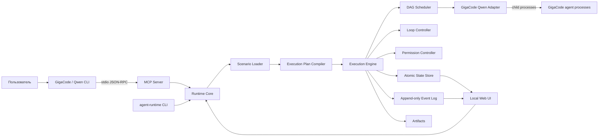
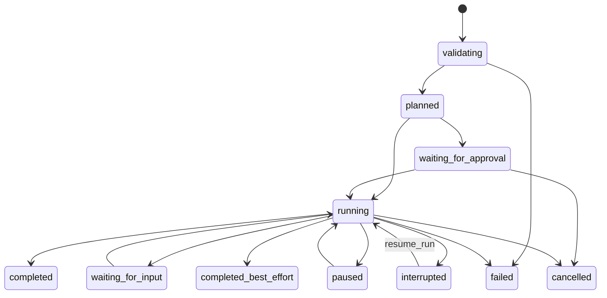

# GigaCode Agent Runtime — дизайн v1

Дата: 2026-07-24

Статус: утверждённый дизайн перед планированием реализации

Целевая платформа v1: macOS x86_64

Целевая среда: Python 3.11–3.14, GigaCode CLI на базе Qwen CLI

Лицензия проекта: Apache-2.0

## 1. Резюме

`gigacode-agent-runtime` — отдельный локальный open-source проект для запуска
декларативных многоагентных сценариев через корпоративный GigaCode CLI.

Пользователь описывает агентов, модели, зависимости, условия, циклы и разрешения
в YAML или JSON. Runtime компилирует сценарий в неизменяемый план выполнения,
запускает независимые процессы GigaCode последовательно или параллельно,
сохраняет состояние и предоставляет результат через локальный MCP, CLI и Web UI.

Проект не является дополнением к существующему Draw.io Skill и не зависит от
него. Из существующей реализации заимствуются только общие архитектурные
принципы: отдельный процесс на роль, маршрутизация моделей, структурированные
результаты, проверка схем, атомарные артефакты, журнал событий и безопасное
возобновление.

## 2. Цели

Версия v1 должна:

1. Устанавливаться на корпоративный Mac полностью офлайн из ZIP.
2. Регистрироваться как локальный `stdio` MCP-сервер в GigaCode CLI.
3. Поддерживать разные модели GigaCode для разных агентов одного сценария.
4. Выполнять последовательные, параллельные и смешанные DAG-сценарии.
5. Поддерживать управляемые циклы review/repair и отдельные технические retry.
6. Сохранять состояние каждого запуска и продолжать прерванный сценарий.
7. Предоставлять локальный Web UI для мониторинга и управления.
8. Поддерживать режимы разрешений от `read_only` до явно включаемого
   `full_access`.
9. Давать предсказуемый, проверяемый и переносимый формат сценариев без
   исполнения произвольного Python или shell-кода из YAML.
10. Иметь тестовый fake GigaCode CLI, чтобы CI не зависел от корпоративного
    backend.

## 3. Не входит в v1

- постоянно работающий daemon или worker после закрытия GigaCode;
- распределённое выполнение на нескольких машинах;
- удалённый HTTP/SSE MCP-сервер;
- Linux-пакет и обещание официальной поддержки Linux;
- другие LLM-провайдеры и публичная provider abstraction;
- произвольные Python-плагины и shell-фрагменты в сценариях;
- вложенные циклы;
- прямой peer-to-peer чат агентов;
- база данных, Redis или внешняя очередь;
- гарантированное продолжение уже запущенного дочернего процесса после
  завершения родительского runtime.

Архитектура не должна искусственно блокировать будущий Linux-порт или отдельный
worker, но ни один из них не является критерием готовности v1.

## 4. Подтверждённые ограничения среды

Дизайн опирается на диагностику корпоративной установки:

- команда GigaCode доступна как `gigacode`;
- используемая сборка основана на Qwen CLI;
- CLI поддерживает `--model`, `--system-prompt`, `--approval-mode`,
  `--allowed-tools`, `--output-format json|stream-json` и MCP;
- локальные `stdio` MCP-серверы поддерживаются командой `gigacode mcp add`;
- на проверенной машине установлен Python 3.14, но пакет `mcp` отсутствует;
- все Python-зависимости runtime поэтому должны находиться внутри offline ZIP.

Эти сведения являются входными ограничениями дизайна, но установщик всё равно
обязан заново проверять фактические версии и возможности CLI на целевой машине.

## 5. Архитектура



### 5.1 Один runtime core

MCP, CLI и Web UI являются тремя интерфейсами к одному runtime core. Они не
реализуют планирование или состояние независимо друг от друга.

### 5.2 Изоляция запуска

Каждый запуск получает уникальный `run_id` и каталог:

```text
~/.gigacode/agent-runtime/runs/<run_id>/
├── run.json
├── scenario.snapshot.yaml
├── effective-config.snapshot.yaml
├── execution-plan.json
├── events.jsonl
├── inputs/
├── steps/
│   └── <step-instance-id>/
│       ├── request.json
│       ├── output.json
│       ├── stdout.jsonl
│       ├── stderr.log
│       └── metadata.json
└── result/
    ├── result.json
    └── summary.md
```

Шаг цикла получает стабильный instance ID с номером итерации, например
`repair_loop.i02.reviewer`.

### 5.3 Процессная модель

Каждый агентский шаг запускается отдельным дочерним процессом `gigacode`.
Параллельность реализуется группой асинхронных задач с ограничителем ресурсов.
Runtime не использует один интерактивный процесс GigaCode для нескольких ролей.

Это даёт:

- независимый выбор модели и разрешений;
- отдельные таймауты и журналы;
- возможность отменять зависший шаг;
- отсутствие смешивания контекста разных агентов;
- воспроизводимый fan-out/fan-in.

## 6. Структура репозитория

```text
gigacode-agent-runtime/
├── pyproject.toml
├── README.md
├── LICENSE
├── CHANGELOG.md
├── src/gigacode_agent_runtime/
│   ├── mcp_server.py
│   ├── cli.py
│   ├── scenario_loader.py
│   ├── plan_compiler.py
│   ├── engine.py
│   ├── scheduler.py
│   ├── loop_controller.py
│   ├── conditions.py
│   ├── permissions.py
│   ├── state_store.py
│   ├── event_log.py
│   ├── diagnostics.py
│   ├── adapters/
│   │   └── gigacode_qwen.py
│   └── web/
│       ├── server.py
│       └── static/
├── schemas/
│   ├── scenario-v1.schema.json
│   ├── execution-plan-v1.schema.json
│   ├── run-state-v1.schema.json
│   └── run-event-v1.schema.json
├── examples/
│   ├── scenarios/
│   │   ├── sequential.yaml
│   │   ├── parallel.yaml
│   │   ├── mixed.yaml
│   │   └── review-repair-loop.yaml
│   └── prompts/
├── optional-skill/
│   └── SKILL.md
├── installer/
│   ├── install-macos.sh
│   ├── uninstall-macos.sh
│   ├── verify-installation.sh
│   └── rollback.sh
├── wheels/
│   └── macos-x86_64/
├── tests/
│   ├── unit/
│   ├── integration/
│   ├── mcp/
│   ├── web/
│   ├── installer/
│   └── fixtures/
│       └── fake_gigacode/
└── docs/
    ├── scenario-format.md
    ├── permissions.md
    ├── loops.md
    ├── web-ui.md
    └── offline-installation.md
```

Папка `optional-skill` содержит только руководство, которое помогает GigaCode
выбирать MCP-инструменты и собирать сценарии. Runtime должен полноценно работать
без установки этого Skill.

## 7. Конфигурация

Используются три уровня:

1. глобальная конфигурация:
   `~/.gigacode/agent-runtime/config.yaml`;
2. встроенный read-only каталог примеров, поставляемый с runtime;
3. пользовательские сценарии:
   `~/.gigacode/agent-runtime/scenarios/`;
4. проектные сценарии:
   `<workspace>/.agent-runtime/scenarios/`.

Приоритет: project → user → builtin. Сценарий более высокого уровня с тем же
`metadata.name` перекрывает нижний. Дубли внутри одного уровня являются
ошибкой. В каждый запуск сохраняется effective config, поэтому изменение
внешнего файла не меняет уже созданный run.

Пример глобальной конфигурации:

```yaml
schema_version: gigacode-agent-runtime/config-v1

runtime:
  data_dir: ~/.gigacode/agent-runtime
  max_parallel_agents: 4
  default_step_timeout_seconds: 900
  graceful_cancel_seconds: 10
  max_stdout_bytes_per_step: 52428800
  max_stderr_bytes_per_step: 10485760

gigacode:
  executable: auto
  model_allowlist:
    - code-model-id
    - review-model-id
  environment_allowlist:
    - PATH
    - HOME
    - LANG
    - LC_ALL
    - SSL_CERT_FILE
    - REQUESTS_CA_BUNDLE
    - HTTPS_PROXY
    - HTTP_PROXY
    - NO_PROXY

permissions:
  default: read_only
  allow_full_access: false
  require_full_access_confirmation: true
  max_parallel_full_access_agents: 1
  max_full_access_loop_iterations: 3
  trusted_scenario_hashes: {}

web:
  enabled: true
  host: 127.0.0.1
  port: auto
  open_automatically: false
```

Неизвестные ключи конфигурации в v1 считаются ошибкой, а не молча
игнорируются.

Значения `code-model-id` и `review-model-id` в примерах — условные идентификаторы.
При установке они заменяются точными model ID, которые принимает конкретная
корпоративная сборка GigaCode.

## 8. Формат сценария

Сценарий является декларативным документом. В нём нет исполняемого кода.

### 8.1 Базовый пример смешанного графа

```yaml
schema_version: gigacode-agent-runtime/scenario-v1
kind: Scenario

metadata:
  name: parallel-analysis
  title: Параллельный анализ и сводный review

inputs:
  task:
    type: string
    required: true

agents:
  analyst_a:
    model: code-model-id
    permissions: read_only
    system_prompt_file: prompts/analyst.md
  analyst_b:
    model: review-model-id
    permissions: read_only
    system_prompt_file: prompts/analyst.md
  reviewer:
    model: code-model-id
    permissions: propose_only
    system_prompt_file: prompts/reviewer.md

steps:
  analyze_a:
    kind: agent
    agent: analyst_a
    needs: []
    prompt:
      template: "Проанализируй задачу: ${inputs.task}"
    output_schema: schemas/analysis.json

  analyze_b:
    kind: agent
    agent: analyst_b
    needs: []
    prompt:
      template: "Найди альтернативное решение: ${inputs.task}"
    output_schema: schemas/analysis.json

  review:
    kind: agent
    agent: reviewer
    needs: [analyze_a, analyze_b]
    prompt:
      template_file: prompts/review.md
      context:
        first: ${steps.analyze_a.output}
        second: ${steps.analyze_b.output}
    output_schema: schemas/review.json

result:
  from: ${steps.review.output}
```

`analyze_a` и `analyze_b` входят в одну волну и запускаются параллельно.
`review` запускается только после успешного завершения обоих.

### 8.2 Компиляция DAG

Компилятор:

1. загружает YAML/JSON и связанные локальные prompt/schema-файлы;
2. проверяет JSON Schema документа;
3. разрешает ссылки только внутри корня сценария или явно разрешённого
   workspace;
4. проверяет существование агентов, входов, шагов и output-ссылок;
5. отвергает циклические `needs`;
6. вычисляет топологические волны;
7. применяет глобальные и сценарные лимиты;
8. фиксирует модели, разрешения, таймауты и retry;
9. строит канонический ExecutionPlan;
10. вычисляет SHA-256 плана.

ExecutionPlan после `start_run` неизменяем. Возобновление использует именно
snapshot плана, а не текущую версию сценария.

### 8.3 Интерполяция

Разрешены только ссылки на типизированные данные:

- `${inputs.<name>}`;
- `${steps.<step>.output}`;
- `${steps.<step>.output.<field>}`;
- `${loop.iteration}`;
- `${loop.previous.<step>.output}`;
- `${run.id}`;
- `${workspace.root}`.

Функции, фильтры, eval, импорт модулей, shell substitution и произвольные
выражения запрещены. Значения передаются как данные и сериализуются без
повторной интерпретации.

### 8.4 Структурированный результат агента

Каждый агентский шаг обязан иметь `output_schema` либо выбрать встроенный
контракт результата. Adapter запрашивает JSON/stream-JSON, извлекает конечный
объект, проверяет его через JSON Schema и только после этого публикует
`step.completed`.

Невалидный JSON относится к технической ошибке шага и может быть обработан
`retry`. Невалидный результат никогда не становится входом следующего шага.

## 9. Планирование параллельности

Scheduler запускает готовые узлы, когда:

- все `needs` завершены допустимым статусом;
- условие `when`, если оно есть, истинно;
- доступен общий concurrency slot;
- доступен slot соответствующего permission-класса;
- не требуется ввод или подтверждение пользователя.

Поддерживаются:

- последовательность: `B needs [A]`;
- полный параллелизм: несколько узлов без `needs`;
- fan-out: несколько узлов зависят от одного;
- fan-in: один узел зависит от нескольких;
- смешанный граф из нескольких волн;
- параллельный DAG внутри одной итерации цикла.

Порядок запуска готовых узлов детерминирован их порядком в ExecutionPlan.
Порядок завершения параллельных процессов не считается детерминированным.

Значение `max_parallel_agents` является верхней границей. Сценарий может
установить меньшее значение, но не больше глобального без отдельного
административного разрешения.

## 10. Циклы

Runtime, а не агент, управляет повторением.

### 10.1 Пример review/repair

```yaml
steps:
  draft:
    kind: agent
    agent: creator
    needs: []
    prompt:
      template: "Создай решение для: ${inputs.task}"
    output_schema: schemas/draft.json

  improve:
    kind: loop
    needs: [draft]
    max_iterations: 5
    timeout_seconds: 3600
    on_limit: pause
    no_progress:
      max_unchanged_iterations: 2
      fingerprint:
        - ${loop.steps.repair.output.content_hash}
        - ${loop.steps.review.output.feedback_hash}
    body:
      steps:
        review:
          kind: agent
          agent: reviewer
          needs: []
          prompt:
            template_file: prompts/review.md
            context:
              candidate: ${loop.previous_or_initial.draft.output}
          output_schema: schemas/review.json

        repair:
          kind: agent
          agent: creator
          needs: [review]
          when:
            ref: ${loop.steps.review.output.approved}
            op: eq
            value: false
          prompt:
            template_file: prompts/repair.md
            context:
              feedback: ${loop.steps.review.output.feedback}
          output_schema: schemas/draft.json

    until:
      ref: ${loop.steps.review.output.approved}
      op: eq
      value: true
```

### 10.2 Условия

Условия являются структурированными объектами. В v1 поддерживаются:

- `eq`, `ne`;
- `lt`, `lte`, `gt`, `gte` для чисел;
- `contains` для строки или массива;
- `exists`;
- логические контейнеры `all`, `any`, `not`.

Типы проверяются до запуска. Произвольные выражения запрещены.

### 10.3 Ограничители

Каждый loop обязан иметь `max_iterations` и/или `timeout_seconds`; effective
plan всегда содержит оба значения после применения defaults.

`on_limit`:

- `fail` — завершить run ошибкой;
- `pause` — ожидать решения пользователя;
- `best_effort` — сохранить последний валидный результат и завершить
  `completed_best_effort`.

No-progress detector вычисляет канонический hash выбранных полей. Если hash не
меняется заданное число итераций, применяется `on_limit` с причиной
`no_progress`.

Для loop, содержащего хотя бы один `full_access` агент, стандартный максимум
равен 3. Увеличение требует глобальной политики.

Вложенные loop запрещены. Независимые loop-узлы могут выполняться параллельно,
если граф и лимиты это позволяют.

### 10.4 Retry не является loop

`retry` повторяет тот же технический вызов после ошибки процесса, таймаута,
временного отказа или невалидного output:

```yaml
retry:
  max_attempts: 3
  backoff_seconds: [1, 5]
  on:
    - process_error
    - transient_cli_error
    - invalid_output
```

Retry не изменяет бизнес-итерацию и имеет отдельный счётчик событий.

## 11. Разрешения и безопасность

### 11.1 Режимы

| Режим | Назначение |
|---|---|
| `read_only` | Анализ без намеренных изменений файлов |
| `propose_only` | Возврат предлагаемого патча/плана без применения |
| `workspace_write` | Автоматические изменения внутри разрешённого workspace |
| `full_access` | Снятие ограничений самого runtime для выбранного агента |

Runtime транслирует режим в доступные флаги GigaCode/Qwen CLI после capability
detection. Если требуемая семантика не может быть обеспечена установленной
версией CLI, запуск останавливается до старта агента с понятной диагностикой.

`full_access`:

- не повышает права процесса операционной системы;
- не обходит TCC, ACL, корпоративные политики и ограничения GigaCode;
- не означает root;
- означает, что runtime не применяет собственный allowlist путей/инструментов
  к этому агенту и использует максимально разрешающий подтверждённый профиль
  GigaCode CLI.

### 11.2 Двойное включение full access

`full_access` разрешён только при одновременном выполнении условий:

1. глобально задано `permissions.allow_full_access: true`;
2. агент сценария явно содержит `permissions: full_access`.

Если `require_full_access_confirmation: true`, run переходит в
`waiting_for_approval`. Подтверждение включает hash ExecutionPlan.

Для заранее доверенного сценария глобальный конфиг может содержать:

```yaml
permissions:
  trusted_scenario_hashes:
    release-pipeline: "sha256:<exact-plan-hash>"
```

Любое изменение сценария, prompt, schema, effective config или
security-relevant capability меняет hash и аннулирует доверие.

Одновременно выполняется не более одного `full_access` агента. Более высокое
значение требует отдельного глобального параметра
`max_parallel_full_access_agents`.

### 11.3 Пути

Все относительные пути канонизируются. До чтения или записи проверяется, что
resolved path находится внутри:

- каталога сценария;
- объявленного workspace;
- каталога конкретного run;
- дополнительного глобального allowlist, если он задан.

Symlink escape и `..` escape запрещены. Для `full_access` эта проверка может
быть снята после двойного включения и подтверждения.

### 11.4 Окружение и секреты

Дочерний процесс получает только минимальный базовый набор переменных и
явный `environment_allowlist`. Значения переменных не записываются в snapshots,
события или Web UI.

Секреты:

- не наследуются автоматически только из-за `full_access`;
- передаются по ссылкам на имена, а не как значения в scenario YAML;
- редактируются в логах по точным значениям и известным шаблонам;
- не включаются в MCP result;
- не сохраняются в `events.jsonl`.

`HOME` может передаваться, чтобы GigaCode использовал существующую
аутентификацию, но runtime не копирует токены в каталог run.

### 11.5 MCP stdio

Стандартный вывод MCP-процесса содержит только протокол JSON-RPC. Логи,
traceback и диагностика направляются в stderr или файлы. Любой случайный текст
в stdout является release-blocking дефектом.

## 12. Состояния запуска

Допустимые состояния:

- `validating`;
- `planned`;
- `running`;
- `waiting_for_input`;
- `waiting_for_approval`;
- `paused`;
- `interrupted`;
- `completed`;
- `completed_best_effort`;
- `failed`;
- `cancelled`.



Переходы проверяются централизованной state machine. Невалидный переход
возвращает typed error и не изменяет файл состояния.

### 12.1 Атомарность

`run.json` записывается во временный файл, синхронизируется и атомарно
заменяется. `events.jsonl` является append-only и flush выполняется после
каждого существенного события.

Run имеет одного writer. Повторный процесс получает lock либо открывает run
только для чтения.

### 12.2 Возобновление

Если MCP/runtime завершился во время `running`, при следующем открытии состояние
нормализуется в `interrupted`. Runtime не пытается присоединиться к старому
дочернему PID.

`resume_run`:

- проверяет snapshot и plan hash;
- сохраняет уже успешно завершённые шаги;
- повторяет только незавершённые или явно retryable шаги;
- продолжает с сохранённого номера loop iteration;
- сохраняет исходный permission contract;
- создаёт событие `run.resumed`.

## 13. Идемпотентность

`start_run` принимает необязательный `idempotency_key`.

Одинаковые `idempotency_key`, scenario/plan hash и inputs hash возвращают
существующий `run_id`. Тот же key с другими данными возвращает конфликт и не
создаёт новый run.

Это защищает от повторной отправки одного MCP tool call после timeout клиента.

## 14. MCP API

MCP является основным интерфейсом автоматизации.

### 14.1 Каталог и планирование

- `list_scenarios`
  - возвращает доступные сценарии, источник и краткие capabilities;
- `describe_scenario`
  - возвращает metadata, inputs, agents, разрешения и ограничения;
- `validate_scenario`
  - принимает имя или inline YAML/JSON, возвращает typed diagnostics;
- `plan_scenario`
  - компилирует dry-run ExecutionPlan, волны, модели, loop и permission gates;
- `diagnose_runtime`
  - проверяет Python, GigaCode executable/version/capabilities, каталоги,
    wheel/runtime version и возможность запуска subprocess.

### 14.2 Выполнение

- `start_run`
  - принимает scenario name или inline definition, inputs, workspace,
    idempotency key;
  - немедленно возвращает `run_id`, status и `dashboard_url`;
- `get_run_status`
  - возвращает state, progress, активные шаги, loop iteration и blockers;
- `get_run_events`
  - отдаёт события после cursor с лимитом;
- `get_run_result`
  - отдаёт конечный typed result;
- `get_run_artifacts`
  - перечисляет безопасные metadata и доступные артефакты;
- `provide_input`
  - передаёт ответ ожидающему input gate;
- `approve_run`
  - подтверждает точный plan hash и permission gate;
- `pause_run`
  - запрещает планирование новых шагов; уже активные шаги штатно завершаются,
    после чего run становится `paused`;
- `resume_run`
  - продолжает `interrupted` или `paused` run;
- `cancel_run`
  - выполняет мягкую остановку и затем принудительную при необходимости;
- `open_dashboard`
  - запускает/находит локальный UI и возвращает URL для run или общего списка.

MCP errors имеют стабильные коды, например:

- `SCENARIO_INVALID`;
- `PLAN_CONFLICT`;
- `MODEL_NOT_ALLOWED`;
- `CAPABILITY_UNAVAILABLE`;
- `PERMISSION_DENIED`;
- `APPROVAL_REQUIRED`;
- `RUN_NOT_FOUND`;
- `INVALID_STATE_TRANSITION`;
- `IDEMPOTENCY_CONFLICT`;
- `STEP_OUTPUT_INVALID`.

Polling является обязательным и достаточным механизмом. MCP progress
notifications могут быть добавлены, но клиент не должен зависеть от них.

## 15. GigaCode/Qwen adapter

Adapter является единственной точкой, знающей CLI-флаги и формат stream events.
Публичный API проекта не использует терминологию других провайдеров.

### 15.1 Capability detection

При диагностике и первом запуске adapter:

1. находит `gigacode` через явный config, `PATH` и затем
   `~/.gigacode/bin/gigacode`;
2. получает version/help;
3. определяет поддержку model, output format, approval mode, allowed tools,
   system prompt и MCP;
4. сохраняет capability snapshot в run;
5. fail closed, если сценарий требует отсутствующую возможность.

Парсинг не должен зависеть только от номера версии: корпоративные сборки могут
иметь отличия.

### 15.2 Вызов агента

Подтверждённый корпоративный контракт Qwen Code 0.13.1 передаёт request через
`--prompt` и использует `stream-json` только для вывода. Входной
`--input-format stream-json` не применяется: фактический CLI не принимает
использовавшийся ранее message envelope. Если stream output недоступен, adapter
использует JSON output.

Команда строится массивом аргументов без shell:

```text
gigacode
  --model <model>
  --system-prompt <resolved prompt>
  --approval-mode <mapped mode>
  --prompt <rendered request>
  --output-format stream-json
```

Для `read_only` и `propose_only` mapped mode равен `default`, а фактическое
ограничение обеспечивается пустыми tools/MCP/extensions. Нативный `plan` не
используется, поскольку включает интерактивный Plan Mode с требованием
`exit_plan_mode`. Фактический порядок и флаги формирует adapter из capability
profile. Строка команды не выполняется через `shell=True`; полные
prompt-аргументы не печатаются в журнал.

### 15.3 Завершение и отмена

Runtime хранит PID и process-group ID. При cancel/timeout:

1. отправляет корректный terminate группе процесса;
2. ждёт `graceful_cancel_seconds`;
3. при необходимости принудительно завершает группу;
4. фиксирует exit code, signal и последний heartbeat;
5. переводит шаг и run в согласованное состояние.

## 16. Event log и наблюдаемость

Каждое событие содержит:

```json
{
  "schema_version": "gigacode-agent-runtime/run-event-v1",
  "event_id": 42,
  "timestamp": "2026-07-24T12:34:56.789Z",
  "run_id": "run_...",
  "type": "step.output",
  "step_instance_id": "analyze_a",
  "payload": {}
}
```

Основные события:

- `run.created`, `run.started`, `run.paused`, `run.resumed`,
  `run.completed`, `run.failed`, `run.cancelled`;
- `plan.compiled`, `permission.requested`, `permission.approved`;
- `step.ready`, `step.started`, `step.heartbeat`, `step.output`,
  `step.retrying`, `step.completed`, `step.failed`;
- `loop.started`, `loop.iteration_started`, `loop.condition_evaluated`,
  `loop.no_progress`, `loop.completed`, `loop.limit_reached`;
- `input.requested`, `input.provided`.

Сырые chain-of-thought данные не запрашиваются, не сохраняются и не
показываются. UI отображает только пользовательские outputs, статусы,
диагностику и явно разрешённые технические логи.

## 17. Web UI

### 17.1 Назначение

UI отвечает на практический вопрос: агент работает, молчит, завис, завершился
или ждёт пользователя.

Экран содержит:

- список активных и прошлых run;
- DAG и текущие волны;
- agent, model, permission и status;
- длительность, PID и время последнего события;
- loop iteration, retry и timeout;
- структурированный output и reviewer feedback;
- stderr и артефакты;
- ожидаемые input/approval;
- кнопки pause, resume, cancel, provide input и approve full access.

### 17.2 Статусы активности

Для активного процесса UI различает:

- `RUNNING` — недавно получено событие;
- `SILENT` — процесс жив, но давно не было вывода;
- `POSSIBLY_STALLED` — процесс жив, превышен warning threshold;
- `TIMED_OUT` — достигнут установленный timeout;
- `PROCESS_EXITED` — процесс завершился.

Тишина сама по себе не считается зависанием. Решение основывается на PID,
process status, последнем output и timeout.

### 17.3 Технологии

- локальный ASGI backend на Python;
- Starlette/Uvicorn либо совместимый минимальный стек;
- статические HTML/CSS/JavaScript без Node/React build;
- Server-Sent Events для обновлений;
- все assets входят в offline ZIP;
- bind только на `127.0.0.1`;
- порт выбирается автоматически или задаётся конфигурацией.

### 17.4 Локальная авторизация

UI создаёт случайный session secret. Ссылка использует fragment bootstrap token,
чтобы токен не попадал в HTTP access log:

```text
http://127.0.0.1:<port>/#token=<one-time-token>
```

Клиент обменивает token на `HttpOnly`, `SameSite=Strict` cookie. SSE и
управляющие запросы требуют эту cookie и CSRF-защиту. Применяется строгий CSP,
внешние scripts/styles запрещены.

### 17.5 Жизненный цикл

Web UI не является daemon:

- при MCP-запуске он лениво поднимается по первому `start_run`,
  `open_dashboard` или явной команде dashboard;
- при включённом Web UI `start_run` возвращает dashboard URL, но браузер
  автоматически не открывается;
- команда `agent-runtime dashboard --open` держит UI в foreground;
- при завершении последнего владеющего процесса UI останавливается;
- состояние run остаётся на диске.

## 18. CLI

CLI предназначен для диагностики, shell/CI и аварийного управления:

```text
agent-runtime diagnose
agent-runtime scenarios list
agent-runtime scenario validate <file>
agent-runtime scenario plan <file> --input key=value
agent-runtime run <name-or-file> --input key=value
agent-runtime status <run-id>
agent-runtime events <run-id> --follow
agent-runtime result <run-id>
agent-runtime resume <run-id>
agent-runtime cancel <run-id>
agent-runtime dashboard [<run-id>] --open
agent-runtime mcp-serve
```

MCP и CLI возвращают согласованные коды ошибок и читают один state store.

## 19. Offline-установка macOS

Release artifact:

```text
gigacode-agent-runtime-v1.0.0-macos-x86_64.zip
gigacode-agent-runtime-v1.0.0-macos-x86_64.zip.sha256
```

ZIP содержит исходный wheel проекта, lock/manifest, все совместимые wheels,
installer, uninstaller, verification script, документацию и примеры.

### 19.1 Установщик

`install-macos.sh`:

1. проверяет macOS и `x86_64`;
2. находит Python 3.11–3.14;
3. проверяет SHA-256/manifest локального комплекта;
4. находит GigaCode CLI;
5. создаёт versioned install directory и внутренний venv;
6. устанавливает пакеты только с `--no-index --find-links`;
7. создаёт data/config/scenario directories без перезаписи пользовательских
   файлов;
8. выполняет `agent-runtime diagnose`;
9. регистрирует MCP примерно следующим контрактом:

   ```text
   gigacode mcp add --scope user --transport stdio \
     gigacode-agent-runtime \
     <absolute-venv>/bin/agent-runtime mcp-serve
   ```

10. проверяет наличие и состояние сервера через `gigacode mcp list`;
11. при любой ошибке откатывает новую регистрацию и versioned install.

Установщик не использует сеть и не вызывает `pip` без `--no-index`.

### 19.2 Обновление и rollback

Каждая версия устанавливается в отдельный каталог. Активная версия выбирается
атомарным указателем/launcher. Перед переключением сохраняется прежняя MCP
регистрация.

`rollback.sh` возвращает последнюю рабочую версию и повторно проверяет MCP.

### 19.3 Удаление

По умолчанию uninstall удаляет регистрацию MCP и binaries, но сохраняет:

- config;
- пользовательские сценарии;
- runs и артефакты.

Удаление данных возможно только отдельным явным `--purge-data` с подтверждением.

## 20. Версионирование

Независимо версионируются:

- Python package/runtime;
- scenario schema;
- ExecutionPlan schema;
- run state schema;
- event schema;
- MCP tool contracts.

Patch release не меняет семантику существующей schema v1. Миграция состояния
выполняется копированием с сохранением исходного snapshot. Runtime не изменяет
неизвестную более новую schema.

## 21. Диагностика

`diagnose_runtime` и `agent-runtime diagnose` должны показывать:

- OS/architecture;
- выбранный Python;
- runtime/schema version;
- GigaCode executable и version;
- обнаруженные CLI capabilities;
- MCP SDK availability внутри runtime venv;
- доступность state/config directories;
- Web UI bind test;
- model allowlist;
- наличие опасных permission settings;
- результаты минимального subprocess smoke test без отправки секретов.

Диагностика возвращает `ok`, `warning` или `error` для каждой проверки и
машиночитаемый JSON по флагу `--json`.

## 22. Тестовая стратегия

### 22.1 Unit

- schema validation и unknown fields;
- path containment и symlink escape;
- DAG cycle detection;
- топологические волны;
- условия и type errors;
- loop limits и no-progress;
- retry policy;
- permission resolution и trust hash;
- canonical plan/hash;
- state machine;
- atomic writes и event cursor;
- idempotency conflict;
- redaction.

### 22.2 Fake GigaCode CLI

Fixture имитирует:

- `--help` и version;
- JSON/stream-JSON;
- задержки и параллельное завершение;
- невалидный JSON;
- stderr;
- transient failure;
- permanent failure;
- timeout;
- отсутствие output;
- процесс, игнорирующий мягкое завершение;
- разные capabilities.

Fixture записывает время старта/завершения, чтобы тест доказывал реальную
параллельность, а не только правильный порядок графа.

### 22.3 Integration

Обязательны сценарии:

- чистая последовательность;
- чистый parallel fan-out;
- mixed fan-out/fan-in;
- review/repair loop;
- max iteration;
- no-progress;
- resume после interruption;
- idempotent повтор `start_run`;
- workspace permissions;
- full access confirmation и hash invalidation;
- ошибка одного параллельного шага;
- cancel process group;
- лимиты логов и timeout.

### 22.4 MCP

- discovery всех tools;
- JSON Schema входов/выходов;
- отсутствие постороннего stdout;
- polling от start до result;
- typed errors;
- повторное подключение и resume.

### 22.5 Web

- локальный bind;
- bootstrap token/session;
- SSE reconnect с cursor;
- DAG/status rendering;
- silent/stalled/timeout classification;
- input/approval/cancel controls;
- отсутствие внешних network assets;
- защита управляющих endpoints.

### 22.6 Installer

На чистой macOS x86_64 среде:

- offline install для каждой поддерживаемой Python minor;
- отсутствие сетевых обращений;
- регистрация MCP;
- `Connected`/эквивалентный успешный статус;
- запуск example scenario через MCP;
- upgrade;
- forced install failure и автоматический rollback;
- обычный uninstall с сохранением данных;
- purge только по явному запросу.

## 23. Критерии готовности v1

Релиз готов, когда:

1. ZIP и `.sha256` воспроизводимо собраны.
2. Чистая offline-установка на macOS x86_64 проходит без PyPI.
3. GigaCode обнаруживает локальный stdio MCP.
4. Sequential, parallel, mixed и loop examples проходят end-to-end.
5. Тест с fake CLI доказывает перекрывающиеся интервалы параллельных шагов.
6. Прерванный run продолжается без повторения уже завершённых шагов.
7. Full access требует установленной политики и корректного подтверждения/hash.
8. Web UI показывает живой статус и позволяет безопасно отменить run.
9. В stdout MCP нет ничего кроме JSON-RPC.
10. Uninstall и rollback проверены.
11. Документация позволяет новому пользователю установить runtime и создать
    собственный сценарий без знания внутреннего Python API.

## 24. Этапы реализации

Детальный task plan будет подготовлен после ревью этой спецификации. Логическая
последовательность реализации:

1. schemas, config loader и ExecutionPlan compiler;
2. state/event store и state machine;
3. fake GigaCode CLI и adapter;
4. DAG scheduler, retry и cancellation;
5. loop controller и resume;
6. permission controller;
7. MCP API;
8. CLI;
9. Web UI;
10. offline installer, packaging и acceptance tests.

## 25. Зафиксированные решения

- проект отдельный от существующих Skills;
- GigaCode/Qwen CLI — единственный backend v1;
- MCP stdio — основной интерфейс;
- CLI — вспомогательный интерфейс;
- Skill — необязательное руководство;
- сценарии задаются YAML/JSON;
- зависимости задаются `needs`;
- scheduler автоматически строит последовательные и параллельные волны;
- состояние хранится локально и поддерживает resume;
- daemon отсутствует;
- циклы контролирует runtime;
- full access доступен уже в v1, но включается двойным разрешением;
- Web UI входит в v1 и доступен только на loopback;
- первый релиз поддерживает только macOS x86_64;
- дистрибутив устанавливается офлайн из ZIP;
- текущий проект Draw.io/GigaCode Skill не изменяется.
